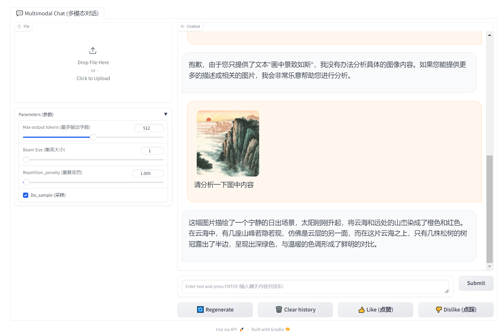

#  书生·浦语大模型全链路开源开放体系课程笔记2
**教程来源**：[书生·浦语大模型全链路开源开放体系](https://github.com/InternLM/Tutorial/blob/camp2/helloworld/homework.md)

## Task 1: 使用 `InternLM2-Chat-1.8B` 模型生成 300 字的小故事

按照教程通过vscode或powershell连接到远程服务器后，按序执行对应代码即可完成任务。

## Task 1.5: 部署 `八戒-Chat-1.8B` 模型

## Task 2: 熟悉 `huggingface` 下载功能，使用 `huggingface_hub` python 包，下载 `InternLM2-Chat-7B` 的 `config.json` 文件到本地

根据[教程](https://github.com/InternLM/Tutorial/blob/camp2/helloworld/homework.md)以及[modelscope手册](https://modelscope.cn/docs/%E6%A8%A1%E5%9E%8B%E7%9A%84%E4%B8%8B%E8%BD%BD)，利用`modelscope.hub.file_download`中的`model_file_download`函数下载`config.json`文件。可以手动指定环境变量`MODELSCOPE_CACHE`到本地缓存目录。

详细代码参见`./src/download.ipynb`。

## Task 3: 完成 `浦语·灵笔2` 的 `图文创作` 及 `视觉问答` 部署

**图文创作**：

**视觉问答**：

## Task 4: 完成 `Lagent` 工具调用 `数据分析` Demo 部署

## 课程总结

- 开发机创建与配置：学习了如何在Intern Studio界面中创建开发机，并配置系统。

- 环境配置：在开发机中，执行一系列命令来配置环境，包括安装必要的库和依赖项。通过激活conda环境，为后续的模型部署和运行做好准备。

- 模型部署与运行：课程详细介绍了如何下载和部署InternLM2-Chat-1.8B模型，并运行了一个智能对话Demo。还学习了如何部署实战营中的优秀作品，如八戒-Chat-1.8B模型，并体验了其角色扮演能力。

- Lagent框架应用：介绍了Lagent框架的基础知识，并指导如何使用Lagent运行InternLM2-Chat-7B模型。通过配置和运行Lagent，体验了流式输出和接口统一的优势。

- 多模态模型实践：课程还涉及了浦语·灵笔2模型的部署，这是一个图文多模态大模型，具有卓越的图文写作和图像理解能力。通过实践部署和运行该模型，了解了其在多模态任务中的应用潜力。