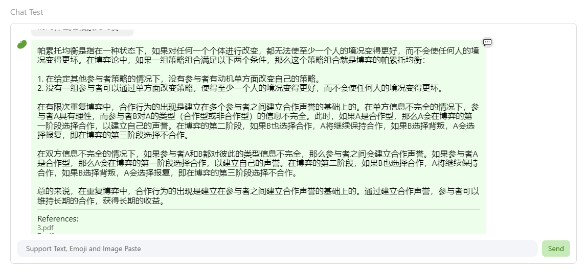

#  书生·浦语大模型全链路开源开放体系课程笔记3
**教程来源**：[书生·浦语大模型全链路开源开放体系](https://github.com/InternLM/Tutorial/blob/camp2/huixiangdou/readme.md)

## 1. 在[茴香豆 Web 版](https://openxlab.org.cn/apps/detail/tpoisonooo/huixiangdou-web)中创建自己领域的知识问答助手

- 参考视频[零编程玩转大模型，学习茴香豆部署群聊助手](https://www.bilibili.com/video/BV1S2421N7mn)

- 完成不少于 400 字的笔记 + 线上茴香豆助手对话截图(不少于5轮)

在互联网时代，信息的获取和处理变得越来越重要。茴香豆Web版作为一个新兴的知识问答平台，为用户提供了一个强大的工具，以创建和定制自己领域的知识问答助手。

茴香豆是一个基于LLMs（Large Language Models）的领域知识助手，它通过应用检索增强生成（RAG）技术，能够理解和高效准确地回应与特定知识领域相关的复杂查询。这种技术的应用使得茴香豆不仅能够提供及时的技术支持，还能在群聊场景中自动回答相关问题，充当智能客服的角色。

要开始使用茴香豆，用户需要访问茴香豆Web版网址。在这里，用户可以创建自己的知识库，上传相关领域的文档，如Markdown文件、Word文档、PPT等。上传文档后，茴香豆会构建知识库，用户便可以开始提问并获取答案。

茴香豆的知识库构建通常是个人与企业的相关技术知识文档，可以设置积极和消极的标签来控制助手的回答范围。此外，用户还可以更新正反例，开关搜索功能，以优化问答助手的性能。

在实际应用中，茴香豆的问答能力非常强大。它不仅能够回答基于文档内容的问题，还能够处理表格和长文本，甚至在遇到敏感话题时，能够及时“装傻”，避免不当回答。这种智能对话的能力，使得茴香豆在教育、科研、商务和生活等多个领域都有广泛的应用。

此外，茴香豆还提供了丰富的操作指南和支持平台。用户可以通过注册账号、登录、提问、获取推荐、构建知识图谱和进行对话等方式与茴香豆互动。茴香豆支持网页端、移动端（iOS和Android）以及微信小程序，提供了免费版和付费版两种定价模式，以满足不同用户的需求。

总之，茴香豆Web版为用户提供了一个简单易用、功能强大的知识问答平台。通过上传文档、构建知识库和智能对话，用户可以轻松创建属于自己的领域知识问答助手，提高工作效率，获取个性化的知识服务。随着技术的不断进步，茴香豆的潜力和应用场景将会更加广泛。

## 2.在 `InternLM Studio` 上部署茴香豆技术助手

- 根据教程文档搭建 `茴香豆技术助手`，针对问题"茴香豆怎么部署到微信群？"进行提问
- 完成不少于 400 字的笔记 + 截图

茴香豆技术助手的部署是一个涉及多个步骤的过程，旨在将智能问答系统整合到微信群中，以便为用户提供即时的技术支持和信息服务。

首先，InternLM Studio提供了一个云端服务器环境，用户可以在此环境中部署茴香豆技术助手。部署前的准备工作包括创建一个开发机器，选择合适的镜像，并配置所需的资源。在开发机中，用户需要复制并运行InternLM的基础环境，以便为茴香豆的运行提供必要的软件依赖。

接下来，用户需要安装茴香豆运行所需的各种依赖包，并通过git克隆茴香豆的官方仓库到本地。这一步是确保茴香豆能够顺利运行的关键，因为这些依赖包含了茴香豆所需的所有库和工具。

然后，用户需要准备模型文件，包括用于向量数据库和词嵌入的模型，以及用于检索和生成回答的大模型。这些模型文件可以通过软连接的方式复制到指定的目录中。这一步是为了确保茴香豆能够使用正确的模型进行问题的回答和知识的检索。

在模型和依赖准备完毕后，用户需要修改茴香豆的配置文件，指定模型的路径，并下载相关的语料库，以便茴香豆能够理解和回答与特定领域相关的问题。此外，用户还需要创建一个测试用的问询列表，用于测试拒答流程是否起效。

完成上述步骤后，用户就可以创建向量数据库，这是茴香豆进行高效检索的关键。向量数据库的创建涉及到将知识语料和用户问题向量化，以便茴香豆能够快速匹配相关问题和答案。

最后，用户可以运行茴香豆知识助手，进行实际的问答测试。在测试过程中，用户可以针对“茴香豆怎么部署到微信群？”这一问题进行提问，验证茴香豆是否能够提供准确和有用的回答。如果回答不尽人意，用户可以根据反馈调整知识库和模型配置，以优化茴香豆的性能。

通过上述步骤，用户可以在InternLM Studio上成功部署茴香豆技术助手，并将其应用于微信群中。这不仅可以提高群聊的互动质量，还能为用户提供即时的技术支持和信息服务，极大地提升了用户体验和工作效率。

## A.【应用方向】 结合自己擅长的领域知识（游戏、法律、电子等）、专业背景，搭建个人工作助手或者垂直领域问答助手，参考茴香豆官方文档，部署到下列任一平台。
  - 飞书、微信
  - 可以使用 茴香豆 Web 版 或 InternLM Studio 云端服务器部署
  - 涵盖部署全过程的作业报告和个人助手问答截图

使用 茴香豆 Web 版部署，文档材料为“博弈与社会”的相关内容，涉及博弈论基础。
部署过程参考[知乎](https://zhuanlan.zhihu.com/p/686579577)。

## B.【算法方向】尝试修改 `good_questions.json`、调试 prompt 或应用其他 NLP 技术，如其他 chunk 方法，提高个人工作助手的表现。
  - 完成不少于 400 字的笔记 ，记录自己的尝试和调试思路，涵盖全过程和改进效果截图

TBD
