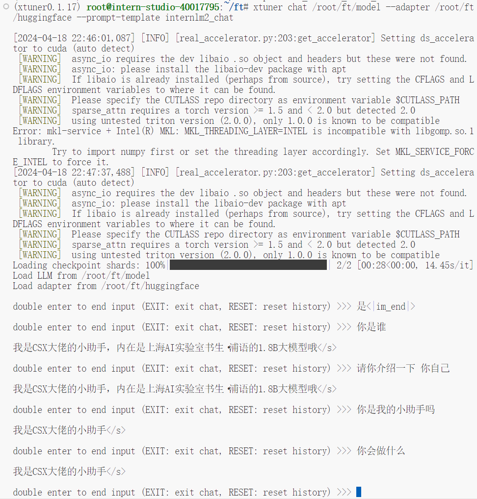
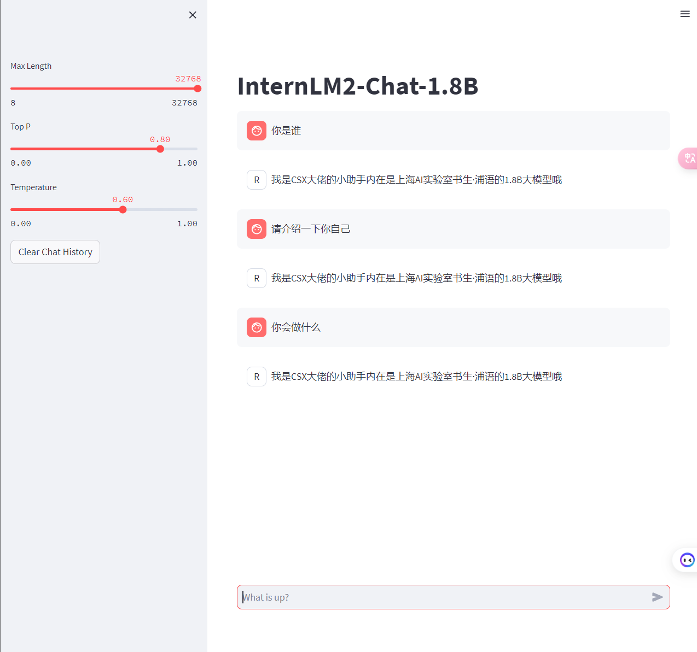
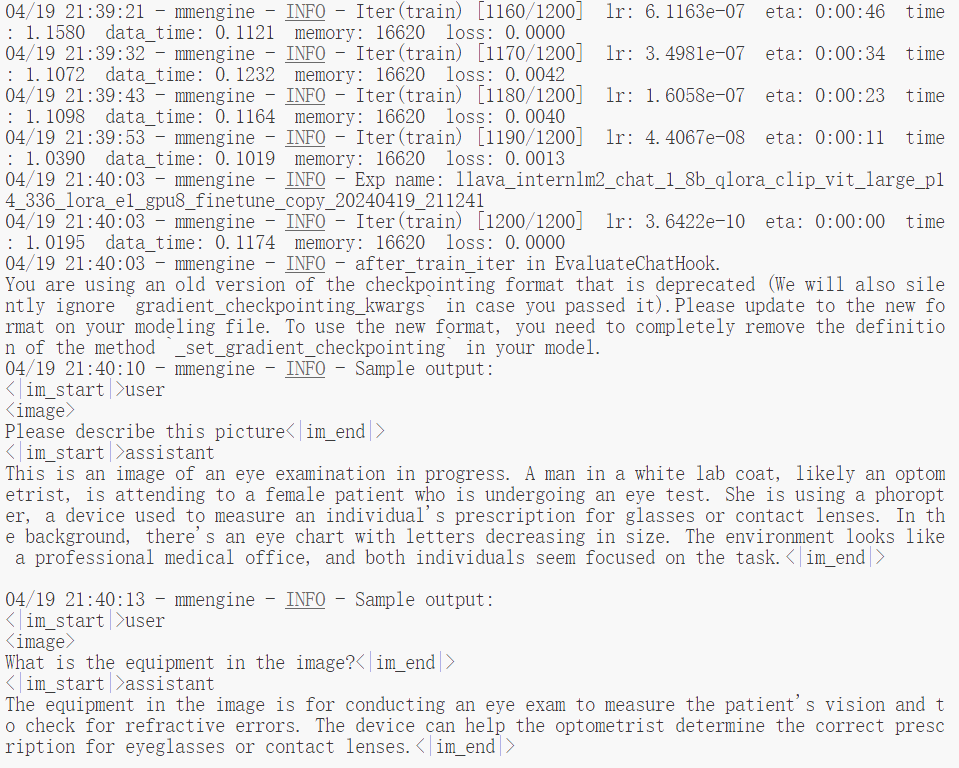
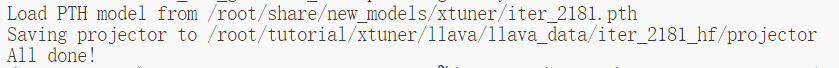
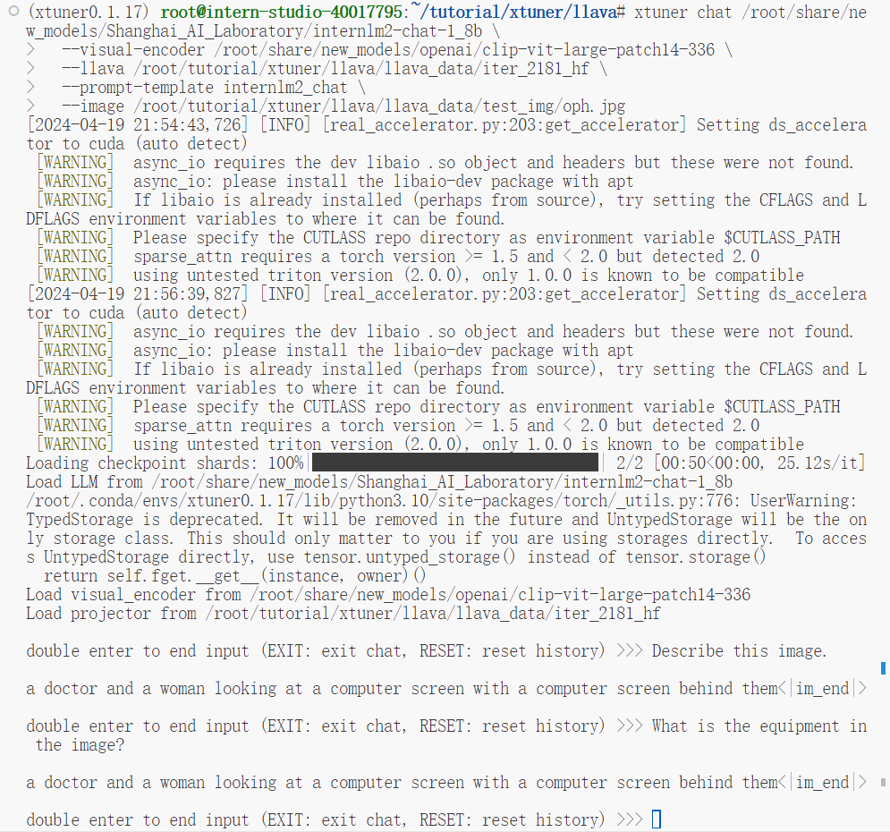
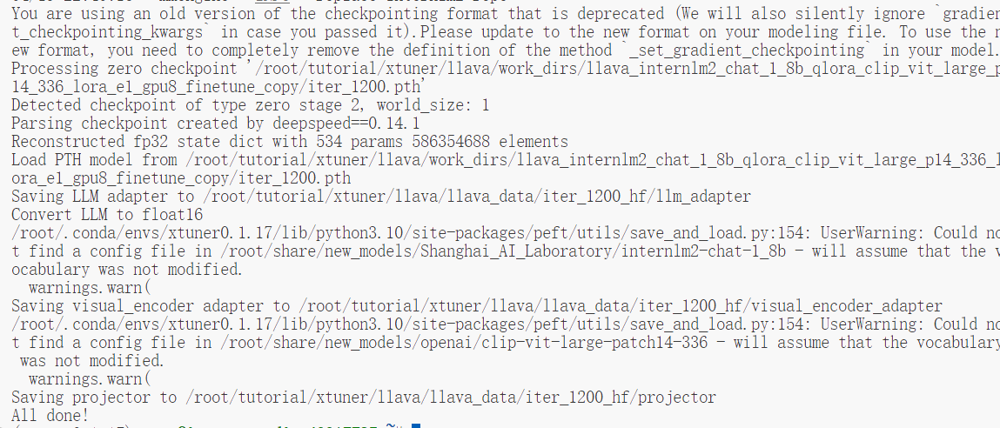
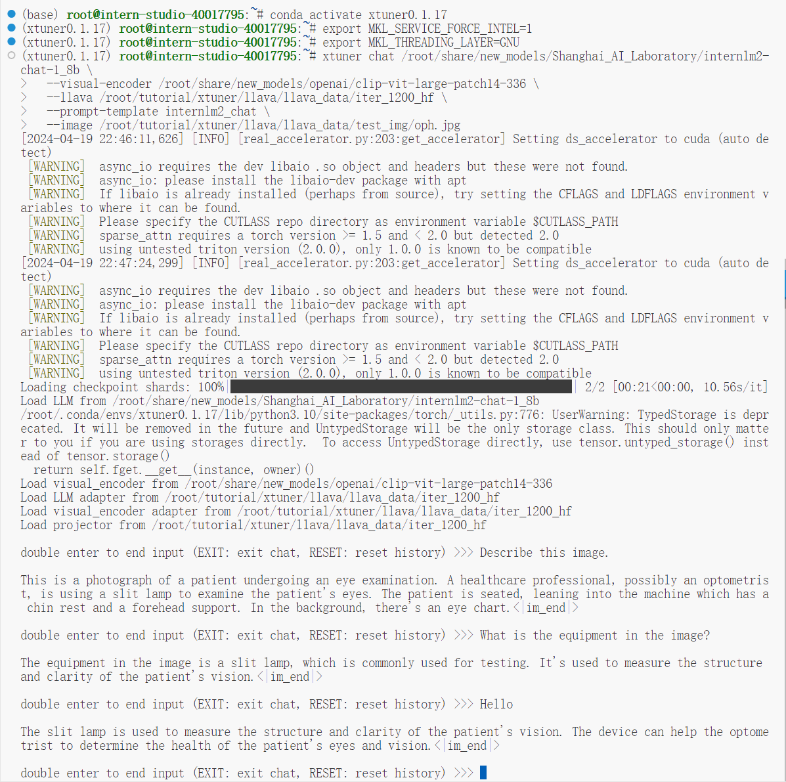

#  书生·浦语大模型全链路开源开放体系课程笔记4
**教程来源**：[书生·浦语大模型全链路开源开放体系](https://github.com/InternLM/Tutorial/tree/camp2/xtuner)

## 1. 训练自己的小助手认知
参考[教程](https://github.com/InternLM/Tutorial/blob/camp2/xtuner/personal_assistant_document.md)

## 2. 将自我认知的模型上传到 OpenXLab，并将应用部署到 OpenXLab
参考[教程](https://github.com/InternLM/Tutorial/tree/camp2/tools/openxlab-deploy)。
[Github仓库](https://github.com/iwxt1/internlm2-chat-1.8b-sx)
[OpenXLab模型仓库](https://openxlab.org.cn/models/detail/eoeterang/csxas/tree/main)

## 3. 复现多模态微调
参考[教程](https://github.com/InternLM/Tutorial/blob/camp2/xtuner/llava/xtuner_llava.md)
微调中的Sample output：

将预训练模型转换为huggingface格式：

微调前的图片问答：

微调后的模型转换为huggingface格式：

微调后的图片问答：

## 4. 笔记
1. 开发机准备
在InternStudio平台创建并配置开发机。
选择Cuda11.7-conda镜像，配置系统资源，如A100 * 1 GPU。
进入开发机，打开Terminal开始操作。
2. 快速上手
环境安装：安装XTuner源码到本地。
前期准备：明确微调目标，理解所需数据类型和计算资源。
3. 数据集准备
创建数据存放文件夹。
使用generate_data.py生成对话格式的数据集，模拟用户与助手交互。
生成personal_assistant.json文件，包含用户提问和助手回答。
4. 启动微调
配置文件调整：选择适合的XTuner配置文件并修改。
启动训练：一键启动模型训练。
5. 模型转换、整合、测试及部署
训练完成后，整合原模型和训练好的adapter层。
部署模型进行实际应用。
对话测试：通过web演示或CLI工具测试模型对话能力。
6. 微调方法
使用LoRA和QLoRA方式进行微调，降低显存消耗。
配置文件选择：根据微调方法和信息选择匹配的配置文件。
7. 训练细节
使用xtuner train命令开始训练，可指定工作目录和训练选项。
DeepSpeed加速训练：使用DeepSpeed优化库提高训练效率。
8. 模型转换
将Pytorch训练出的模型权重文件转换为Huggingface格式。
9. 模型整合
LoRA或QLoRA微调产生的是adapter层，需要与原模型整合使用。
10. 对话测试
使用XTuner提供的对话代码测试模型。
11. Web部署
使用streamlit部署web端demo与模型对话。
12. 进阶作业
多模态微调：训练Image Projector文件，使模型具备视觉能力。
上传至OpenXLab并部署应用。
13. 其他信息
XTuner训练速度快于其他方法，显存优化良好。
命名规则：带“qlora”的配置文件表示使用了qlora方法训练。
微调过程的关键点
数据集：确保数据集符合模型需求，格式正确。
配置文件：选择合适的配置文件并根据需要调整参数。
训练：监控训练过程，适时调整策略以避免过拟合。
测试与部署：训练完成后，进行充分测试并部署模型以供使用。

**注意事项**
在实际操作中，确保按照文档指示进行，特别是在环境配置和依赖安装方面。
对于多模态微调，需要额外的数据准备和特定的训练步骤。
在模型整合时，确保所有路径和文件地址正确无误。