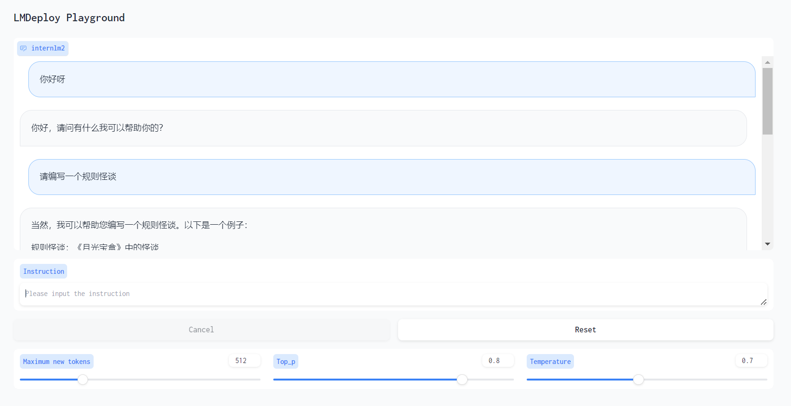

#  书生·浦语大模型全链路开源开放体系课程笔记5
**教程来源**：[书生·浦语大模型全链路开源开放体系](https://github.com/InternLM/Tutorial/blob/camp2/lmdeploy/README.md)

## 1. 配置 LMDeploy 运行环境
在远程服务器终端运行指令`studio-conda -t lmdeploy -o pytorch-2.1.2`，随后激活环境`conda activate lmdeploy`，并安装`lmdeploy`库`pip install lmdeploy[all]==0.3.0`。

检测环境：
参照教程编写`pipeline_transformer.py`文件，在`lmdeploy`环境下运行`python pipeline_transformer.py`，正确对话说明环境成功配置。

## 2. 以命令行方式与 InternLM2-Chat-1.8B 模型对话
激活`lmdeploy`环境，运行`lmdeploy chat [InternLM2-Chat-1.8B路径]`，即可与模型对话。可以明显感受到，相比于之前检测环境配置时的对话，用lmdeploy直接对话更加流畅。

## 3. 设置KV Cache最大占用比例为0.4，开启W4A16量化，以命令行方式与模型对话
执行`lmdeploy lite auto_awq \
   /root/models/Shanghai_AI_Laboratory/internlm2-chat-1_8b \
  --calib-dataset 'ptb' \
  --calib-samples 128 \
  --calib-seqlen 1024 \
  --w-bits 4 \
  --w-group-size 128 \
  --work-dir /root/internlm2-chat-1_8b-4bit`将模型量化为W4A16，随后执行`lmdeploy chat /root/internlm2-chat-1_8b-4bit --model-format awq --cache-max-entry-count 0.01`，即可与模型对话。可以明显感受到，相比于之前对话，用lmdeploy量化后对话更加流畅。
显存占用情况：

模型问答：

## 4. 以API Server方式启动 lmdeploy，开启 W4A16量化，调整KV Cache的占用比例为0.4，分别使用命令行客户端与Gradio网页客户端与模型对话
### 4.1 启动API Server
执行`lmdeploy serve api_server \
    /root/internlm2-chat-1_8b-4bit \
    --model-format awq \
    --cache-max-entry-count 0.4 \
    --quant-policy 0 \
    --server-name 0.0.0.0 \
    --server-port 23333 \
    --tp 1`
启动API Server。

### 4.2 命令行客户端
执行`lmdeploy serve api_client http://localhost:23333`，即可与模型对话。

### 4.3 Gradio网页客户端
执行`lmdeploy serve gradio http://localhost:23333 \
    --server-name 0.0.0.0 \
    --server-port 6006`，启动Gradio网页客户端。

模型问答：

## 5. 使用W4A16量化，调整KV Cache的占用比例为0.4，使用Python代码集成的方式运行internlm2-chat-1.8b模型
Python代码如下：

模型问答：

## 6. 使用 LMDeploy 运行视觉多模态大模型 llava gradio demo
参照教程填入代码并运行相关指令：

## 7. 将 LMDeploy Web Demo 部署到 [OpenXLab](https://github.com/InternLM/Tutorial/blob/camp2/tools/openxlab-deploy)
[GitHub地址](https://github.com/iwxt1/internlm2-chat-1.8b-4bit/tree/main)
[OpenXLab地址](https://openxlab.org.cn/models/detail/eoeterang/internlm2_1_8b_4bit/tree/master)

## 8. 笔记
1. 环境配置
使用Cuda12.2-conda环境和10% A100*1 GPU在InternStudio开发机上创建conda环境。
激活conda环境后，安装LMDeploy。
2. 模型对话
使用Transformer库运行模型，设置torch_dtype=torch.float16以避免OOM错误。
使用LMDeploy与模型进行对话，通过调整KV Cache最大占用比例和量化策略来优化显存占用和推理速度。
3. LMDeploy量化部署
KV8量化和W4A16量化用于优化LLM模型的显存占用。
KV Cache管理器通过--cache-max-entry-count参数控制显存占用比例。
使用AWQ算法进行模型4bit权重量化，提高推理速度。
4. LMDeploy服务（Serve）
提供API接口服务，分为模型推理/服务、API Server和Client三个模块。
启动API服务，设置KV Cache比例和量化策略。
5. Python代码集成
使用LMDeploy的pipeline函数运行1.8B模型，并通过TurbomindEngineConfig传递参数。
6. LMDeploy运行视觉多模态大模型
安装依赖库，使用pipeline加载llava模型并进行图片描述。
使用Gradio创建网页客户端，通过ssh转发端口实现网页访问。
7. 定量比较LMDeploy与Transformer库的推理速度
使用Python API进行推理，统计生成的word个数和所需时间，比较两者的推理速度。
8. 实战营课程笔记
提供了LMDeploy的安装、配置、运行和量化的详细步骤。
介绍了如何使用LMDeploy进行模型对话、量化部署和API服务。
9. 实战营作业
包含了创建开发机、配置环境、运行模型、使用LMDeploy与模型对话、模型量化、启动api服务器和python代码集成等任务。
10. GitHub资源
提供了LMDeploy的官方文档和教程，以及相关的GitHub项目链接。