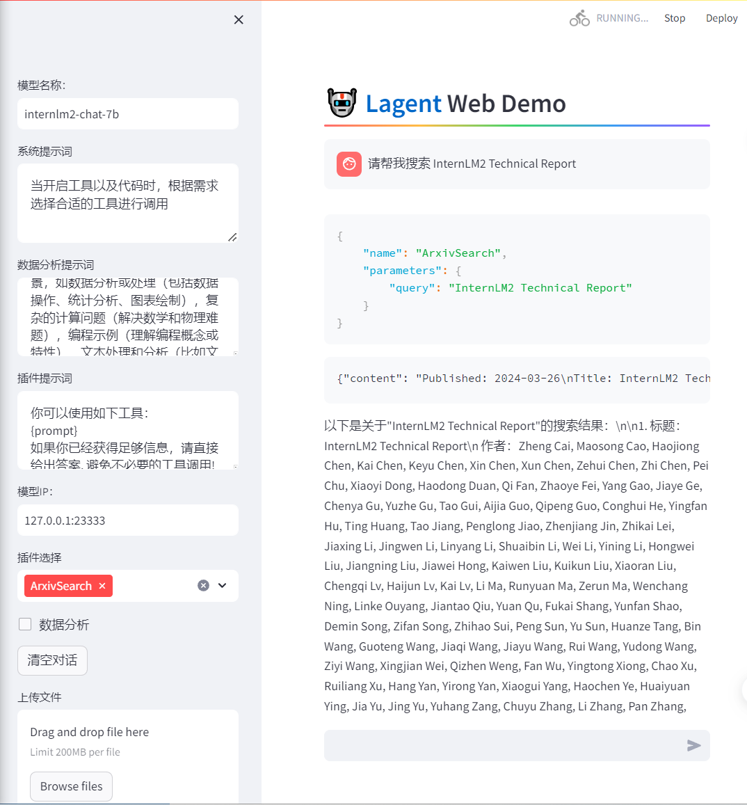

#  书生·浦语大模型全链路开源开放体系课程笔记6
**教程来源**：[书生·浦语大模型全链路开源开放体系](https://github.com/InternLM/Tutorial/blob/camp2/agent/README.md)

## 1. 完成 Lagent Web Demo 使用
[参考教程](https://github.com/InternLM/Tutorial/blob/camp2/agent/lagent.md#1-lagent-web-demo)



## 2. 完成 AgentLego 直接使用部分
[参考教程](https://github.com/InternLM/Tutorial/blob/camp2/agent/agentlego.md#1-%E7%9B%B4%E6%8E%A5%E4%BD%BF%E7%94%A8-agentlego)


## 3. 完成 AgentLego WebUI 使用
[参考教程](https://github.com/InternLM/Tutorial/blob/camp2/agent/agentlego.md#2-%E4%BD%9C%E4%B8%BA%E6%99%BA%E8%83%BD%E4%BD%93%E5%B7%A5%E5%85%B7%E4%BD%BF%E7%94%A8)


## 4. 使用 Lagent 或 AgentLego 实现自定义工具并完成调用
[参考教程1](https://github.com/InternLM/Tutorial/blob/camp2/agent/lagent.md#2-%E7%94%A8-lagent-%E8%87%AA%E5%AE%9A%E4%B9%89%E5%B7%A5%E5%85%B7)
[参考教程2](https://github.com/InternLM/Tutorial/blob/camp2/agent/agentlego.md#3-%E7%94%A8-agentlego-%E8%87%AA%E5%AE%9A%E4%B9%89%E5%B7%A5%E5%85%B7)

### 4.1 使用 Lagent 实现自定义工具（天气查询）


### 4.2 使用 AgentLego 实现自定义工具（图像生成）


## 5. 笔记
### Lagent
Lagent 是一个轻量级的开源智能Agent体框架，旨在让用户能够高效地构建基于大语言模型（LLM）的智能体。这个框架提供了丰富的组件和功能，包括代理（Agent）、搜索器（Searcher）、计算器（Calculator）以及行为树（Action Executor）等，从而支持多种智能体范式，如AutoGPT、ReWoo和ReAct等。

### AgentLego
AgentLego 是一个多模态工具包，旨在通过乐高积木式的快速简便方式，帮助用户拓展自定义工具，从而组装出自己的智能体。它支持多个智能体框架，如Lagent、LangChain、Transformers Agents等，为用户提供了丰富的选择和灵活性。

### 环境配置
1. 创建存放Agent的目录：
   ```bash
   mkdir -p /root/agent
   ```
配置 CUDA 环境和安装必要的依赖。
安装 Lagent 和 AgentLego
克隆 Lagent 和 AgentLego 的仓库，并安装：
```bash
cd /root/agent
conda activate agent
git clone https://gitee.com/internlm/lagent.git
cd lagent && git checkout 581d9fb && pip install -e . && cd ..
git clone https://gitee.com/internlm/agentlego.git
cd agentlego && git checkout 7769e0d && pip install -e . && cd ..
```
### 使用 Lagent
以Lagent Web Demo为例，用 LMdeploy 部署并启动 api_server，然后通过 Streamlit 启动 Web Demo。

### 自定义工具
继承 BaseAction 类，实现工具的 run 方法。
使用 tool_api 装饰器来注册工具。

### 使用 AgentLego
直接使用 AgentLego，下载 demo 文件并安装所需依赖。
编写 Python 脚本来加载工具并应用到图像上。

#### 作为智能体工具使用
修改配置文件以使用特定的模型。使用 LMDeploy 部署 api_server。启动 AgentLego WebUI 并通过 WebUI 配置 Agent 和工具。
**自定义工具**
创建工具文件，继承 BaseTool 类，并实现工具功能。
注册新工具并体验自定义工具的效果。