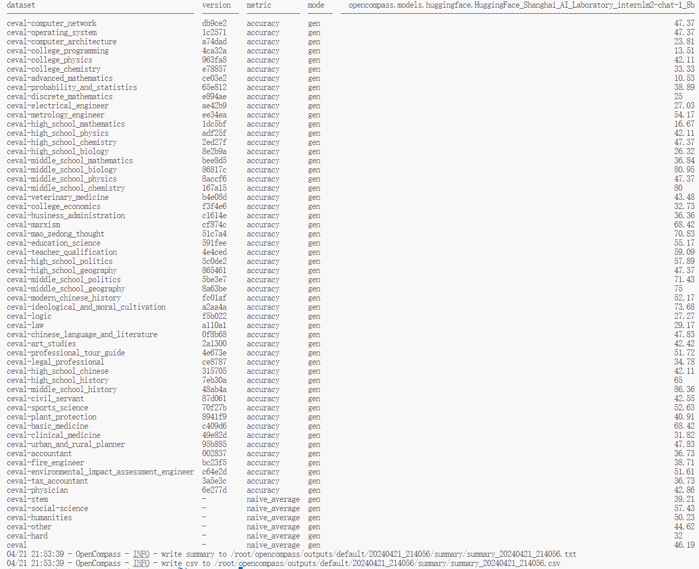

#  书生·浦语大模型全链路开源开放体系课程笔记7
**教程来源**：[书生·浦语大模型全链路开源开放体系](https://github.com/InternLM/Tutorial/blob/camp2/opencompass/readme.md)

## 1. 使用 OpenCompass 评测 internlm2-chat-1_8b 模型在 C-Eval 数据集上的性能


## 2. 笔记
OpenCompass 是一个评估模型，用于自动化测试和评估机器学习模型的性能。它支持多种数据集和评估策略，可以生成详细的评估报告，并支持结果的可视化。

**配置和运行**
- 配置：用户可以配置评估过程，选择要评估的模型和数据集。此外，还可以选择评估策略、计算后端等，并定义显示结果的方式。
- 命令行运行：通过执行 `python run.py` 命令并附加相应参数来运行 OpenCompass。例如，使用特定的数据集、模型路径、分词器路径等。
- 环境变量设置：在某些情况下，可能需要设置环境变量，如MKL_SERVICE_FORCE_INTEL=1 来解决兼容性问题。
- 依赖安装：需要安装 OpenCompass 依赖的第三方库，可以通过 pip install -r requirements.txt 来安装。

**评估过程**
- 任务分区：评估过程会被拆分为多个同时运行的任务以提高效率。
- 错误处理：如果在评估过程中遇到错误，如没有任何预测输出，需要根据错误信息进行调试。

**结果输出**
- 可视化：OpenCompass 能将结果整理为表格，并可以保存为 csv 或 txt 文件。
- 上报：结果也可以在飞书中上报。
- 
**示例命令**
```bash
python run.py \
    --datasets ceval_gen \
    --hf-path /share/new_models/Shanghai_AI_Laboratory/internlm2-chat-1_8b \
    --tokenizer-path /share/new_models/Shanghai_AI_Laboratory/internlm2-chat-1_8b \
    --tokenizer-kwargs padding_side='left' truncation='left' trust_remote_code=True \
    --model-kwargs device_map='auto' trust_remote_code=True \
    --max-seq-len 2048 \
    --max-out-len 16 \
    --batch-size 4 \
    --num-gpus 1 \
    --debug
```
**遇到的问题及解决方案**
- MKL 服务错误：如果遇到与 MKL 服务相关的错误，尝试设置环境变量 MKL_SERVICE_FORCE_INTEL=1。
- 依赖缺失：如果缺少依赖，需要安装 protobuf 等缺失的库。